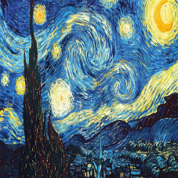
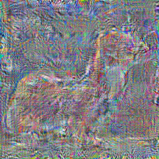
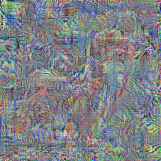

# Artistic Style Transfer

Implementing [A Neural Algorithm of Artistic Style](https://arxiv.org/pdf/1508.06576v2.pdf) using [AlexNet](http://www.cs.toronto.edu/~guerzhoy/tf_alexnet/) architecture in TensorFlow.

I arbitrarily decided to use `conv5` for content and `conv4` for style. More tuning needs to be done to find good parameters.

To run, first download the pre-trained AlexNet weights with
```
curl -O http://www.cs.toronto.edu/~guerzhoy/tf_alexnet/bvlc_alexnet.npy
```

Known issue:

AlexNet uses image whitening to pre-process the image. This means that I need to "un-whiten" the image after doing gradient descent to reconstruct the image. Unfortunately, I think my current un-whitening is insufficient to recover the colors.

Content: 

Style: 

Reconstruction (content-focus): 

Reconstruction (style-focus): 
